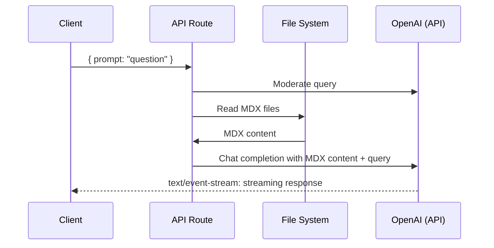

# Next.js OpenAI Chatbot

A simple, database-free chatbot that uses OpenAI GPT-4o to answer questions based on your `.mdx` documentation files. This app reads MDX files directly at runtime and injects their content into OpenAI prompts—no embeddings or database required.

## Deploy

Deploy this app to Vercel. All you need is your `OPENAI_KEY` environment variable and you're ready to go!

[](https://vercel.com/new/clone?demo-title=Next.js%20OpenAI%20Chatbot&demo-description=A%20simple%20ChatGPT-style%20chatbot%20powered%20by%20Next.js%20and%20OpenAI%20that%20reads%20MDX%20files%20directly.&demo-url=https%3A%2F%2Fvercel.com&project-name=nextjs-openai-chatbot&repository-name=nextjs-openai-chatbot&from=github&env=OPENAI_KEY&envDescription=Get%20your%20OpenAI%20API%20key%3A&envLink=https%3A%2F%2Fplatform.openai.com%2Faccount%2Fapi-keys)

## Technical Details

This chatbot works by:

1. **🏃 Runtime** Reading `.mdx` files from the `pages/docs` directory
2. **🏃 Runtime** Extracting plain text content from MDX (removing JSX/MDX syntax)
3. **🏃 Runtime** Injecting the content directly into OpenAI GPT-4o prompts
4. **🏃 Runtime** Streaming the response back to the client

### Architecture



### Key Features

- **No Database Required**: Reads MDX files directly from the filesystem
- **No Embeddings**: Simple approach that works out of the box
- **Streaming Responses**: Real-time streaming using Server-Sent Events (SSE)
- **Content Moderation**: Automatically moderates user queries via OpenAI
- **Type-Safe**: Built with TypeScript

## Local Development

### Prerequisites

- Node.js 20+ 
- pnpm (or npm/yarn)

### Configuration

1. Copy the environment example file:
   ```bash
   cp .env.example .env
   ```

2. Set your `OPENAI_KEY` in the `.env` file:
   ```
   OPENAI_KEY=your_openai_api_key_here
   ```

### Start the App

```bash
# Install dependencies
pnpm install

# Start the development server
pnpm dev
```

The app will be available at `http://localhost:3000`.

### Using Your Custom MDX Docs

1. Place your `.mdx` files in the `pages/docs/` directory
2. The app will automatically read and use them when answering questions
3. No build step required—just restart the dev server if you add new files

Currently supported files:
- `pages/docs/DavidYoonResume.mdx`
- `pages/docs/KnowledgeCollection.mdx`

## How It Works

### Runtime Flow

1. **User submits a question** via the search dialog (⌘K or click the search button)
2. **API route receives the query** and:
   - Moderates the content using OpenAI's moderation API
   - Reads all MDX files from `pages/docs/` using `readMdxFiles()`
   - Extracts plain text from MDX (removes JSX/MDX syntax)
3. **OpenAI processes the request**:
   - The prompt includes the full MDX content plus the user's question
   - GPT-4o generates a response based on the provided context
4. **Response streams to client** in real-time using SSE format

### File Structure

```
pages/
  api/
    vector-search.ts    # API route that handles chat requests
  docs/
    *.mdx               # Your documentation files
lib/
  read-mdx-files.ts     # Utility to read and parse MDX files
  errors.ts             # Error handling utilities
components/
  SearchDialog.tsx      # Chat UI component
```

## Environment Variables

| Variable | Description | Required |
|----------|-------------|----------|
| `OPENAI_KEY` | Your OpenAI API key | Yes |

## Tech Stack

- **Framework**: Next.js 13 (Pages Router)
- **AI**: OpenAI GPT-4o
- **Streaming**: Vercel AI SDK
- **UI**: React, Tailwind CSS, Radix UI
- **Language**: TypeScript

## License

Apache 2.0
